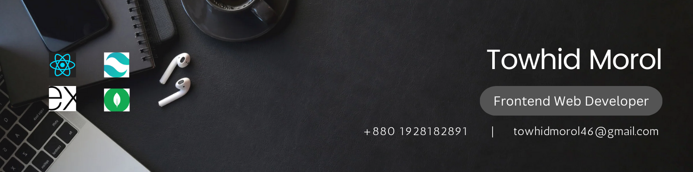

 
<h1>About Me</h1>

 Hi there, My name is <em>Towhid Morol</em>, I am a Front-end web developer. I feel confident to building front-end web application by using  HTML, CSS, Tailwind CSS, JavaScript, React, and Firebase Authentication. I also have a familiarity with some backend technologies such as NodeJs, Express.js, and MongoDB. My goal is to become a full stack web developer who make eye catch front end with cool running backend. Beside my web development I am engage in cycling, reading, praying and etc.

<h1>Streaks</h1>

- 🔭 I’m currently working on Frontend Development
- 🌱 I’m currently learning Next JS
- 👯 I’m looking to collaborate on GitHub
- 🤔 I’m looking for help with MERN Stack Development
- 💬 Ask me about Web Development
- 📫 How to reach me: Email: towhidmorol46@gmail.com
- ⚡ Fun fact: #codding
